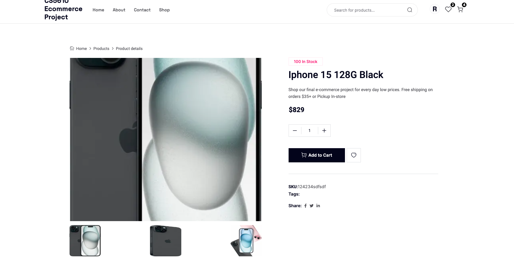

Basically, we have 3 sub-repos in our project: Admin, front-end, and back-end respectively.

##### How to run the program?
1. Go directly into the /back_end directory first and run "npm install", and run "npm run start-dev" Then you will see the back-end up and running
2. Navigate to the /front-end directory and run "npm install" and "npm run dev" so that the front end will be running in the meantime.
3. Finally go to the /admin and run the same as step 2 -- "npm install" and "npm run dev"

#### Project goal:
The goal of this project is to develop a fully functional e-commerce platform tailored for online retail. The website will enable users to browse through a catalog of products, add items to a shopping cart, and complete purchases via an integrated checkout system. The platform will be designed with a focus on user-friendly navigation, responsive design for cross-device compatibility, and a secure transaction process. To enhance the shopping experience, features such as product recommendations, user reviews, and order tracking will be incorporated. The backend will be structured to support inventory management, order processing, and data analytics for business insights. This project aims to synthesize full-stack(MERN stack) development skills by building an application that could serve as a cornerstone in a web development portfolio.

#### User stories
For Unauthenticated Customers

As an unauthenticated customer:

* I want to browse through a variety of products on a clean and intuitive interface so that I can explore products without needing to log in.
* I can search for products using keywords and filter results by various attributes like price, brand, and rating.
* I can view detailed product descriptions, images, and customer reviews.
* I can add products to my shopping cart or wishlist but will be prompted to log in or register when I attempt to check out or access my wishlist.

For Authenticated Customers

As an authenticated customer,
* I want to log into my account so that I can access personalized features like my profile, shopping cart, wishlist, and order history, and track the status of my current orders.
* I can complete the checkout process by entering shipping information, choosing a payment method, and reviewing my order before finalization, with the system saving my information for future purchases.
* I expect to receive a confirmation of my order with an order number and a confirmation email.
* I can also review or check my order history in my profile.

For Administrators

As an administrator,
* I want to log into a backend dashboard so that I can manage the e-commerce platform effectively.
* I can add new products, including setting descriptions, images, and prices.
* I can view recent order data to monitor sales and inventory levels.
* I can manage promotions and push new deals to the website to engage customers.

### UI Design
1. Navigation bar:

2. Menu icon:

3. Homepage:

4. Login:

5. Shopping Cart:

6. about page:

6. Contact Page:

7. Product details page:

8. Checkout page:

